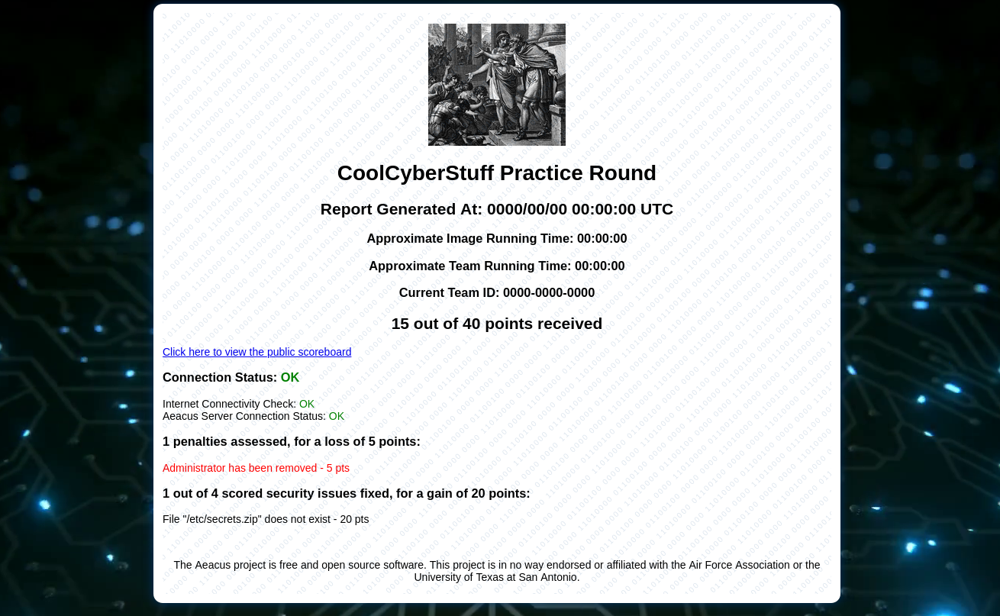

# aeacus

This is a client-side scoring system meant to imitate the functionality of UTSA's CIAS CyberPatriot Scoring System (CSS) with an emphasis on simplicity. Named after the Greek myth of King Aeacus, a judge of the dead.

dev command
```
DOCKER_ID=$(sudo docker run -v $(pwd):/opt/aeacus -p 80:80 -t -d ubuntu)
sudo docker exec -it $DOCKER_ID "/bin/bash"
cd /opt/aeacus && ./install.sh
```

## Installation

0. Download the most recent zip from releases into /opt/ on your vulnerable virtual machine.
```
cd /opt && git clone https://github.com/sourque/aeacus/releases...
```
1. Write your config in `/opt/aeacus/scoring.conf`.
> Don't have a config? See the example at the bottom of this README.

2. Check that your config is valid.
```
aeacus --verbose check
```
3. Score the image with the current config to verify your checks work as expected.
```
aeacus --verbose score
```
4. Prepare the image for release.
```
aeacus --verbose release
```
> WARNING: this will remove `scoring.conf`. Back it up somewhere if you want to save it!

## Screenshot



## Features

- In-depth and simple vulnerability scorer
- Image deployment (cleanup, README, etc)
- Remote score reporting through a REST-like API

## Checks

This is a list of vulnerability checks that can be used in the configuration for aeacus.

> __Note!__ Each of these check types can be used for either `Pass` or `Fail` conditions, and there can be multiple `Pass` or `Fail` conditions per check.

__Command__: pass if command succeeds (exit code `0`)
```
type="Command"
arg1="grep 'pam_history.so' /etc/pam.d/common-password"
```

> __Note!__ Each of the commands here can check for the opposite by appending "Not" to the check type. For example, `CommandNot` to pass if a command does not return exit code `0`.

__FileExists__: pass if specified file exists
```
type="FileExists"
arg1="/etc/passwd"
```

__FileContains__: pass if file contains string
```
type="FileContains"
arg1="/home/coolUser/Desktop/Forensic Question 1.txt"
arg2="ANSWER: SomeCoolAnswer"
```

__FileContainsRegex__: pass if file contains regex string
```
type="FileContains"
arg1="/home/coolUser/Desktop/Forensic Question 1.txt"
arg2="ANSWER:\sCool[a-zA-Z]+VariedAnswer"
```

__FileEquals__: pass if file equals sha1 hash
```
type="FileEquals"
arg1="/etc/sysctl.conf"
arg2="403926033d001b5279df37cbbe5287b7c7c267fa"
```

__PackageInstalled__: pass if package is installed
```
type="PackageInstalled"
arg1="tcpd"
```

__UserExists__: pass if user exists on system
```
type="UserExists"
arg1="ballen"
```

> __Note!__ If a check has negative points assigned to it, it automatically becomes a penalty.

## Configuration

The configuration is written in TOML. See the below example:

```
# Cool Practice Image
name = "ubuntu-18-supercool" # Unique identifier name
title = "CoolCyberStuff Practice Round" # Round title
user = "coolUser" # Main user for the image
# permitted_time_range

[[check]]
message = "Removed insecure sudoers rule"
points = 10 # Points for the check

    [[check.pass]]
    type="FileContainsNot"
    arg1="/etc/sudoers"
    arg2="NOPASSWD"

[[check]]
# If no message is specified, one is auto-generated
points = 20

    [[check.pass]]
    type="FileExistsNot"
    arg1="/etc/secrets.zip"

    [[check.pass]] # You can code multiple pass conditions
    type="Command" # If any pass, the check passes
    arg1="ufw status"

[[check]]
# If no points are specified, they are auto-calculated
# out of 100 points
# ex. 50 specified points, 5 checks with no points specified
# then they're 10 points each
    [[check.pass]]
    type="CommandNot"
    arg1="cat /etc/passwd /etc/shadow"

[[check]]
message = "Change /etc/passwd"
points = 10

    [[check.pass]]
    type="FileEqualsNot"
    arg1="/etc/passwd"
    arg2="232963f8231342b55b85d450065e106fad105242"

    [[check.fail]]       # If any fail conditions pass,
    type="FileExistsNot" # the check fails, even if
    arg1="/etc/passwd"   # pass conditions succeeded

[[check]]
message = "Administrator has been removed"
points = -5 # This check is now a penalty

    [[check.pass]]
    type="UserExistsNot"
    arg1="coolAdmin"

```

## Contributing and Disclaimer

Thanks to Tanay for help with this project!

If you have anything you would like to add or fix, please make a pull request! No improvement or fix is too small, and help is always appreciated.

This project is in no way affiliated with or endorsed by the Air Force Association, University of Texas San Antonio, or the CyberPatriot program.
